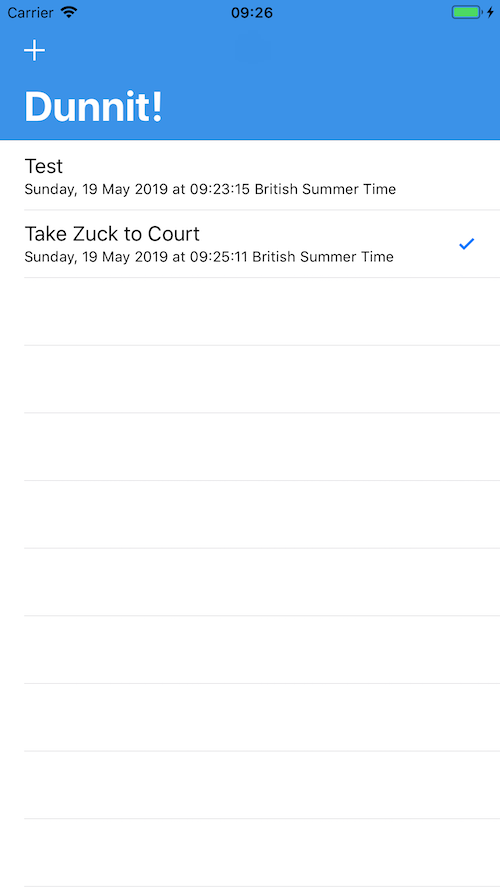

# Dunnit!
## Yeah, another iOS to-do list app.

I created this as a learning exercise whilst getting to grips with Test-Driven Development (TDD) with Swift in XCode. I wanted to create a simple app from the outside in, starting with feature tests then creating unit tests as and when required.

## Features

Current features:

- Add to-do items
- Delete to-do items
- Toggle items completion status
- Reminder alerts
- Persisting of data (saving to a local/remote database)

Features to come:

- Multiple lists of todo items (work, home, school, etc)

Enhancements to come:

- UI will scale to work on all devices (currently only scalesorks on iPhone 8 Plus until I set the constraints/pinning)

## Issues & Bugs

Issues are being tracked on GitHub, over [here](https://github.com/acodeguy/Dunnit/issues).

## Minimum Viable Product (MVP)
For the MVP of this app, it will have the following features:

- Add to-do items
- Delete to-do items
- Toggle items completion status

### 2/5/19: Data Persistence
I've plumbed-in Core Data to store the data locally now, so todo items will persist over app closure and phone restarts.

### 19/5/19: Add NavigationController, tests updated


### 27/4/19: MVP Reached!


At this point, all items are kept in memory and not persisted. This is coming in a later version of this app.

## Approach

I've used TDD to write the code. I've used to MVC design pattern with an idea to possibly move this over to MVVM once I get my head around it.

I wanted to dive-in to getting to know as many features of the iOS SDK, and so far I've managed to encorporate the following into this project:

### Building the app
- Core Data
- UserNofications (UNUserNotificationCenter)

### Testing the app
- XCTest
- iOS simulator
- an actual iPhone

## Issues Faced

- Testing for the UITableCell's accessory (checkmark) has proven impossible upto this point 

## Getting Started with this Code

1. Clone this repo: ```git clone https://github.com/acodeguy/Dunnit.git```
2. Open it in Xcode
3. Run the tests: ```Cmd+U```
4. Run the project in the simulator: ```Cmd+R```

## Tests
This project has both UI and unit tests, found in the usual test folders. I've written this using TDD to drive development of only the absolutely essential code to make it work.

### Installation/Dependencies

At the moment, this project has no third-party depdencies. This may change if I decide to really pimp it out with some Cocoapods for networking, storage, etc.

## License

Use it, abuse it. But please don't sell it.
